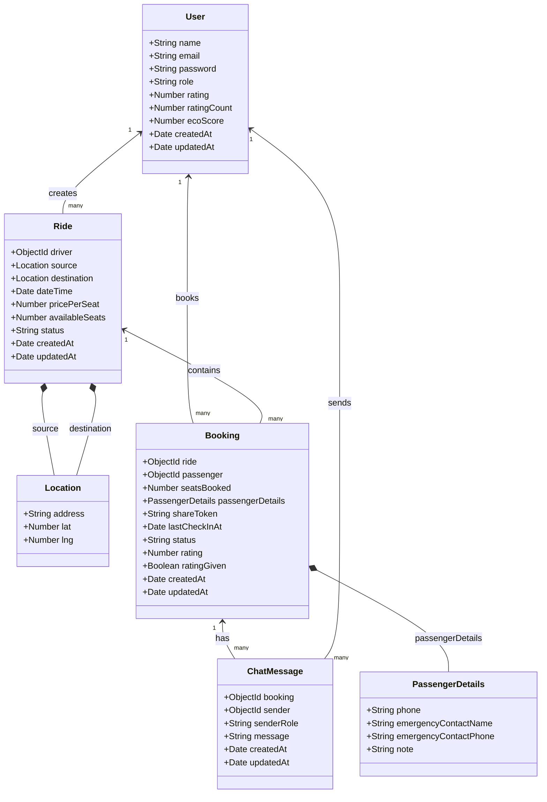

# Class Diagram

This class diagram is based on the actual data model used in the CarPool project. It reflects the Mongoose schemas and their relationships in the backend.

## Short Explanation

- `User` represents both passengers and drivers, distinguished by the `role` field.
- `Ride` stores trip information created by a driver, including source, destination, date, fare, seat count, and status.
- `Booking` connects a passenger with a ride and stores safety details, booking status, rating data, and share token.
- `ChatMessage` stores messages exchanged between the passenger and driver for a specific booking.
- `Location` and `PassengerDetails` are embedded structures used inside `Ride` and `Booking`.

## Suggested Report Caption

**Figure: Class diagram of the CarPool platform showing the core backend entities and their relationships.**
