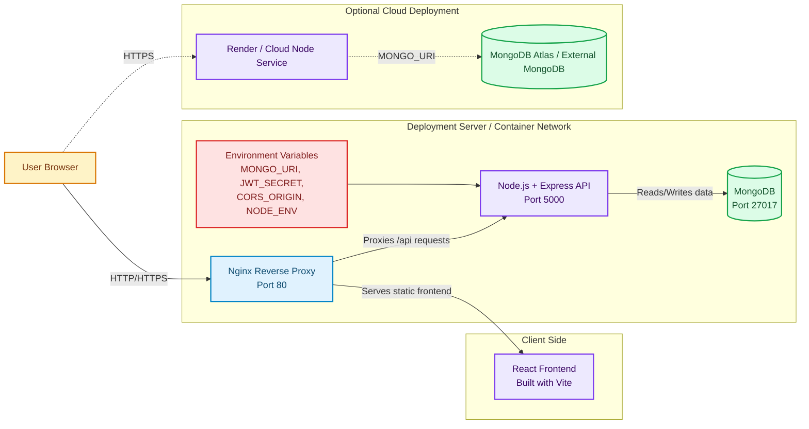

# Deployment Diagram

This deployment diagram is based on the deployment setup present in this repository, including Docker Compose, Nginx reverse proxy, Express backend, and MongoDB database.

## Short Explanation

- The user accesses the system through a browser.
- In containerized deployment, `Nginx` acts as the entry point and reverse proxy.
- Static frontend files are served to the browser, while API requests are forwarded to the `Node.js + Express` backend.
- The backend connects to `MongoDB` for storing users, rides, bookings, and chat messages.
- Runtime behavior is controlled through environment variables such as `MONGO_URI`, `JWT_SECRET`, `CORS_ORIGIN`, and `NODE_ENV`.
- The repository also includes a cloud deployment option where the Node service can run on Render and connect to an external MongoDB instance like MongoDB Atlas.

## Suggested Report Caption

**Figure: Deployment diagram of the CarPool platform showing browser access, Nginx reverse proxy, Express backend, MongoDB database, and optional cloud deployment.**
