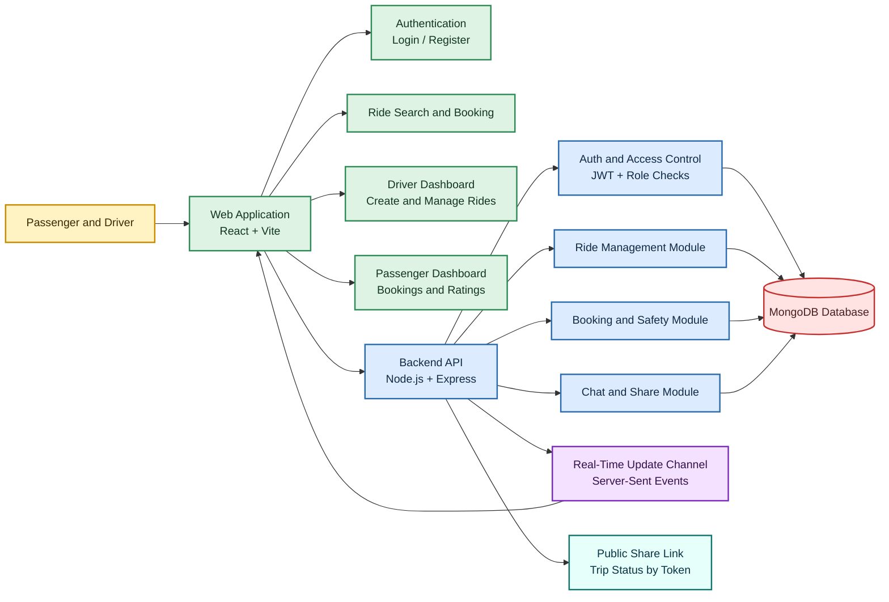

# Presentation-Style Architecture Diagram

This version is simplified for presentations, viva, reports, and slides. It focuses on the main system blocks and user-facing flow instead of low-level implementation details.

## Slide-Friendly Explanation

- Users interact with a single web application built using React and Vite.
- The frontend sends requests to an Express backend that handles authentication, rides, bookings, dashboards, chat, and sharing.
- MongoDB stores all persistent data such as users, rides, bookings, and chat messages.
- Server-Sent Events provide lightweight real-time updates for booking, cancellation, and check-in changes.
- Public share links allow trip information to be viewed without logging in.

## Suggested Caption

**Figure: High-level system architecture of the CarPool platform showing users, frontend, backend services, MongoDB storage, and real-time updates.**
