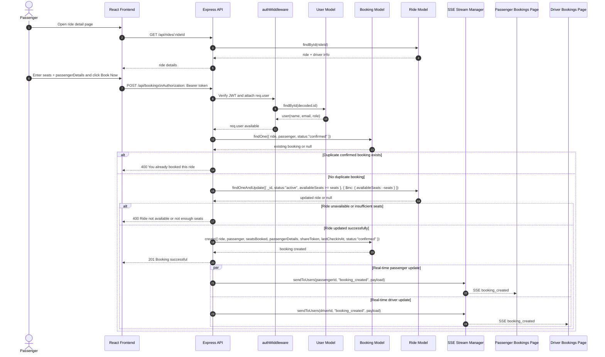

# Sequence Diagram

This sequence diagram is tailored to the current implementation of this repository. It reflects the actual ride-booking flow used in the CarPool platform, including JWT authentication, duplicate-booking checks, seat updates, booking creation, and SSE notifications.

## Short Explanation

- The passenger first loads the ride details using `GET /api/rides/:rideId`.
- When the passenger books a ride, the request goes through `authMiddleware`, which validates the JWT and loads the current user from the database.
- The backend checks whether the passenger already has a confirmed booking for the same ride.
- If no duplicate exists, the system atomically reduces `availableSeats` using `Ride.findOneAndUpdate(...)`.
- After the ride is successfully updated, the system creates the booking with `shareToken`, `passengerDetails`, and `lastCheckInAt`.
- Finally, the backend returns success and emits a `booking_created` event through the SSE stream manager to both passenger and driver clients.

## Suggested Report Caption

**Figure: Exact sequence diagram of the CarPool ride-booking process based on the implemented frontend, Express API, MongoDB models, authentication middleware, and SSE notifications.**
