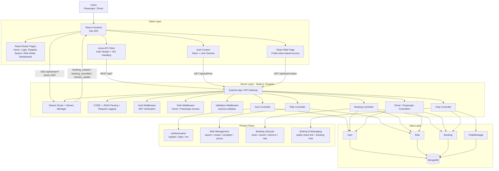

# System Architecture Diagram

This diagram reflects the current implementation in this repository: React + Vite frontend, Express + Node.js backend, MongoDB persistence, JWT auth, and Server-Sent Events for booking/check-in updates.

For a cleaner slide-friendly version, see [PRESENTATION_ARCHITECTURE.md](PRESENTATION_ARCHITECTURE.md).

## Component Summary

- `client/` provides the SPA UI, route navigation, auth state, and API calls.
- `server/server.js` is the live backend entry point and wires routes, MongoDB, CORS, and SSE streaming.
- `server/src/routes/` exposes auth, rides, bookings, drivers, passengers, chat, stream, and share APIs.
- `server/src/controllers/` contains business logic for ride search, booking lifecycle, dashboards, ratings, and chat.
- `server/src/models/` stores the core domain entities: `User`, `Ride`, `Booking`, and `ChatMessage`.
- `server/src/utils/streamManager.js` pushes real-time booking/check-in events to connected clients using Server-Sent Events.

## High-Level Request Flow

1. A passenger or driver uses the React app in the browser.
2. The frontend calls Express APIs with Axios and attaches the JWT from local storage.
3. Express validates input, authenticates the user, checks role permissions, and runs controller logic.
4. Controllers read/write MongoDB through Mongoose models.
5. For booking events, the backend also emits SSE updates through the stream manager to active clients.
6. Public share links bypass login and fetch booking details through `/api/share/:token`.
