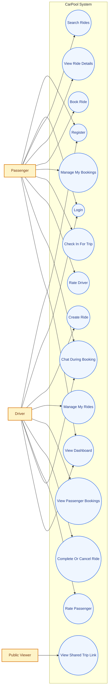

# Use Case Diagram

This use case diagram is designed for reports and project documentation. It summarizes how the main actors interact with the CarPool system.

## Short Explanation

- `Passenger` can register, log in, search rides, view ride details, book seats, manage bookings, check in, chat, view dashboard data, and rate drivers.
- `Driver` can register, log in, create rides, manage rides, view passengers for a ride, complete or cancel rides, chat, view dashboard data, and rate passengers.
- `Public Viewer` can access a shared trip link without logging in.

## Suggested Report Caption

**Figure: Use case diagram of the CarPool platform showing the interactions of Passenger, Driver, and Public Viewer with the system.**
